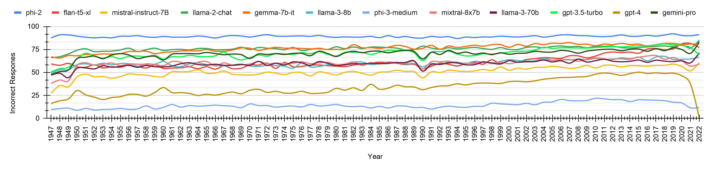

# TempUN Dataset
We introduce **TempUN**, an extensive and balanced dataset ranging from 10,000 BCE to 2100 CE. The dataset was obtained through web scraping from the following [Our World in Data](https://ourworldindata.org/) is curated based on global issues and priorities as delineated by the [United Nations](https://www.un.org/en/global-issues) and [EU](https://www.undp.org/european-union/our-focus). **TempUN** mitigates the bias towards immutable facts found in TempLAMA; only 16.13\% of its facts remain unaltered, resulting in 83.87\% of the facts being subject to change. **TempUN** encompasses approximately 462,894 records, from which a substantial number of temporal prompts, 9,497,502 (denoted as **Large**), have been derived. However, to accommodate the computational constraints of larger models, we also offer a compressed version of the dataset, which consists of a random selection of 1,907 instances corresponding to 104,130 prompts (referred to as **Small**).

Dataset Link: [Drive](https://drive.google.com/drive/u/2/folders/1ci_Ni4ab5fQ5-x4Ly9n_FW9_rlBOKqiM)

# Inference

## Zeroshot
### Open-source models:
#### Using vLLM:
We have utillized vLLM for getting inference from `phi-2`, `mistral-instruct-v0.2`, and `llama-2-chat`. The code for inference is located in the `inference/zeroshot/open-source/inf_vllm.py` file. To get inference run below command:

    CUDA_VISIBLE_DEVICES=0 python inf_vllm.py --hub-model-name mistralai/Mistral-7B-Instruct-v0.2 --base-dir /path_to_csvs --out-dir /path_to_results --year 1947

#### Using transformers:
We have utillized transformers for getting inference from `flan-t5-xl`, and `phi-3-medium-instruct`. The code for inference is located in the `inference/zeroshot/open-source/inf_transformers.py` file. To get inference run below command:

    CUDA_VISIBLE_DEVICES=0 python inf_transformers.py --hub-model-name microsoft/Phi-3-medium-128k-instruct --base-dir /path_to_csvs --out-dir /path_to_results --year 1947

#### Using Groq:
We have utillized transformers for getting inference from `gemma-1.1-7b-it`, `Meta-Llama-3-8B-Instruct`, `Mixtral-8x7B-Instruct-v0.1`, and `Meta-Llama-3-70B-Instruct`. The code for inference is located in the `inference/zeroshot/open-source/inf_groq.py` file. To get inference run below command:

    python inf_groq.py --base-dir /path_to_csvs --out-dir /path_to_results --year 1947

- Change the model in the script to run the inference for the desired LLM.

### Closed-source models:
We have performed inference on three closed-source models: `gpt-3.5-turbo`, `gpt-4`, and `gemini-pro`. 

- The code for inference for models `gpt-3.5-turbo` and `gpt-4` is located in the `inference/zeroshot/closed-source/inf_openai.py` file. To get inference run below command:

      python inf_openai.py --api-key YOUR_OPENAI_API_KEY --api-base YOUR_API_BASE_URL --engine YOUR_ENGINE_NAME --base-dir /path_to_csvs --out-dir /path_to_results --year 1947

- The code for inference for model `gemini-pro` is located in the `inference/zeroshot/closed-source/inf_gemini.py` file. To get inference run below command:

      python inf_gemini.py --api-key YOUR_GEMINI_API_KEY --base-dir /path_to_csvs --out-dir /path_to_results --year 1947

Below table contains comparative performance of LLMs for different MCQ categories under **zero-shot** settings (Scale over here is 0-1). Here, 'C' (Correct), 'I' (Incorrect), and 'N' (Information Not Available) represent the percentage of correct generations, incorrect generations, and LLMs generation of information not available, respectively. We **bold** the highest values for 'C', and lowest values for 'I' and 'N' categories. Here, we distinguish between open-source and closed-source LLMs with the **bold** and not bold respectively.
<table>
  <tr>
    <th>Models</th>
    <th>Generation</th>
    <th>DB</th>
    <th>CP</th>
    <th>WB</th>
    <th>MM</th>
    <th>RB</th>
    <th>TB</th>
    <th>Average</th>
  </tr>
  <tr>
    <td rowspan="3"><b>phi-2</b></td>
    <td><b>C &uarr;</b></td>
    <td>.11</td>
    <td>0</td>
    <td>.18</td>
    <td>.08</td>
    <td>.09</td>
    <td>.06</td>
    <td>.09</td>
  </tr>
  <tr>
    <td><b>I &darr;</b></td>
    <td>.89</td>
    <td>.97</td>
    <td>.82</td>
    <td>.92</td>
    <td>.89</td>
    <td>.93</td>
    <td>.90</td>
  </tr>
  <tr>
    <td><b>N &darr;</b></td>
    <td><b>0</b></td>
    <td>.03</td>
    <td><b>0</b></td>
    <td><b>0</b></td>
    <td>.02</td>
    <td>.01</td>
    <td>.01</td>
  </tr>
  <tr>
    <td rowspan="3"><b>flan-t5-xl</b></td>
    <td><b>C &uarr;</b></td>
    <td>.38</td>
    <td>.40</td>
    <td>.20</td>
    <td>.24</td>
    <td>.20</td>
    <td>.03</td>
    <td>.30</td>
  </tr>
  <tr>
    <td><b>I &darr;</b></td>
    <td>.62</td>
    <td>.60</td>
    <td>.80</td>
    <td>.76</td>
    <td>.79</td>
    <td>.97</td>
    <td>.69</td>
  </tr>
  <tr>
    <td><b>N &darr;</b></td>
    <td><b>0</b></td>
    <td><b>0</b></td>
    <td><b>0</b></td>
    <td><b>0</b></td>
    <td>.01</td>
    <td><b>0</b></td>
    <td><b>0</b></td>
  </tr>
  <tr>
    <td rowspan="3"><b>mistral-instruct</b></td>
    <td><b>C &uarr;</b></td>
    <td>.37</td>
    <td>.43</td>
    <td>.20</td>
    <td>.23</td>
    <td>.34</td>
    <td><b>.08</b></td>
    <td>.27</td>
  </tr>
  <tr>
    <td><b>I &darr;</b></td>
    <td>.51</td>
    <td>.57</td>
    <td>.80</td>
    <td>.64</td>
    <td>.66</td>
    <td>.71</td>
    <td>.65</td>
  </tr>
  <tr>
    <td><b>N &darr;</b></td>
    <td>.12</td>
    <td><b>0</b></td>
    <td><b>0</b></td>
    <td>.13</td>
    <td><b>0</b></td>
    <td>.22</td>
    <td>.08</td>
  </tr>
  <tr>
    <td rowspan="3"><b>llama-2-chat</b></td>
    <td><b>C &uarr;</b></td>
    <td>.21</td>
    <td>.45</td>
    <td>.22</td>
    <td>.15</td>
    <td>.22</td>
    <td>.05</td>
    <td>.21</td>
  </tr>
  <tr>
    <td><b>I &darr;</b></td>
    <td>.76</td>
    <td>.55</td>
    <td>.78</td>
    <td>.81</td>
    <td>.79</td>
    <td>.93</td>
    <td>.77</td>
  </tr>
  <tr>
    <td><b>N &darr;</b></td>
    <td>.03</td>
    <td><b>0</b></td>
    <td><b>0</b></td>
    <td>.04</td>
    <td><b>0</b></td>
    <td>.02</td>
    <td>.02</td>
  </tr>
  <tr>
    <td rowspan="3"><b>gemma-7b-it</b></td>
    <td><b>C &uarr;</b></td>
    <td>.21</td>
    <td>.42</td>
    <td>.15</td>
    <td>.12</td>
    <td>.14</td>
    <td>.03</td>
    <td>.19</td>
  </tr>
  <tr>
    <td><b>I &darr;</b></td>
    <td>.77</td>
    <td>.58</td>
    <td>.85</td>
    <td>.88</td>
    <td>.86</td>
    <td>.94</td>
    <td>.79</td>
  </tr>
  <tr>
    <td><b>N &darr;</b></td>
    <td>.02</td>
    <td><b>0</b></td>
    <td><b>0</b></td>
    <td><b>0</b></td>
    <td><b>0</b></td>
    <td>.03</td>
    <td>.01</td>
  </tr>
  <tr>
    <td rowspan="3"><b>llama-3-8b</b></td>
    <td><b>C &uarr;</b></td>
    <td>.39</td>
    <td>.39</td>
    <td>.19</td>
    <td>.18</td>
    <td>.24</td>
    <td>.07</td>
    <td>.31</td>
  </tr>
  <tr>
    <td><b>I &darr;</b></td>
    <td>.61</td>
    <td>.61</td>
    <td>.81</td>
    <td>.82</td>
    <td>.76</td>
    <td>.93</td>
    <td>.69</td>
  </tr>
  <tr>
    <td><b>N &darr;</b></td>
    <td>.01</td>
    <td><b>0</b></td>
    <td><b>0</b></td>
    <td><b>0</b></td>
    <td><b>0</b></td>
    <td><b>0</b></td>
    <td><b>0</b></td>
  </tr>
  <tr>
    <td rowspan="3"><b>phi-3-medium</b></td>
    <td><b>C &uarr;</b></td>
    <td>.09</td>
    <td><b>.49</b></td>
    <td>.37</td>
    <td>.10</td>
    <td>.01</td>
    <td>.01</td>
    <td>.14</td>
  </tr>
  <tr>
    <td><b>I &darr;</b></td>
    <td><b>.16</b></td>
    <td>.47</td>
    <td><b>.31</b></td>
    <td><b>.27</b></td>
    <td><b>.03</b></td>
    <td>.53</td>
    <td><b>.24</b></td>
  </tr>
  <tr>
    <td><b>N &darr;</b></td>
    <td>.74</td>
    <td>.05</td>
    <td>.33</td>
    <td>.63</td>
    <td>.96</td>
    <td>.46</td>
    <td>.62</td>
  </tr>
  <tr>
    <td rowspan="3"><b>mixtral-8x7b</b></td>
    <td><b>C &uarr;</b></td>
    <td>.33</td>
    <td>.34</td>
    <td>.29</td>
    <td>.18</td>
    <td>.29</td>
    <td>.03</td>
    <td>.28</td>
  </tr>
  <tr>
    <td><b>I &darr;</b></td>
    <td>.61</td>
    <td>.64</td>
    <td>.71</td>
    <td>.82</td>
    <td>.71</td>
    <td>.94</td>
    <td>.68</td>
  </tr>
  <tr>
    <td><b>N &darr;</b></td>
    <td>.07</td>
    <td>.02</td>
    <td><b>0</b></td>
    <td><b>0</b></td>
    <td><b>0</b></td>
    <td>.03</td>
    <td>.04</td>
  </tr>
  <tr>
    <td rowspan="3"><b>llama-3-70b</b></td>
    <td><b>C &uarr;</b></td>
    <td><b>.40</b></td>
    <td>.37</td>
    <td><b>.55</b></td>
    <td><b>.37</b></td>
    <td><b>.38</b></td>
    <td>.01</td>
    <td><b>.37</b></td>
  </tr>
  <tr>
    <td><b>I &darr;</b></td>
    <td>.60</td>
    <td>.63</td>
    <td>.45</td>
    <td>.63</td>
    <td>.62</td>
    <td>.99</td>
    <td>.63</td>
  </tr>
  <tr>
    <td><b>N &darr;</b></td>
    <td><b>0</b></td>
    <td><b>0</b></td>
    <td><b>0</b></td>
    <td><b>0</b></td>
    <td><b>0</b></td>
    <td><b>0</b></td>
    <td><b>0</b></td>
  </tr>
  <tr>
    <td rowspan="3">gpt-3.5-turbo</td>
    <td><b>C &uarr;</b></td>
    <td>.27</td>
    <td>.39</td>
    <td>.16</td>
    <td>.19</td>
    <td>.12</td>
    <td>0</td>
    <td>.19</td>
  </tr>
  <tr>
    <td><b>I &darr;</b></td>
    <td>.72</td>
    <td>.61</td>
    <td>.84</td>
    <td>.81</td>
    <td>.88</td>
    <td>.99</td>
    <td>.81</td>
  </tr>
  <tr>
    <td><b>N &darr;</b></td>
    <td>.01</td>
    <td><b>0</b></td>
    <td><b>0</b></td>
    <td><b>0</b></td>
    <td>.01</td>
    <td>.01</td>
    <td>.01</td>
  </tr>
  <tr>
    <td rowspan="3">gpt-4</td>
    <td><b>C &uarr;</b></td>
    <td>.29</td>
    <td>.02</td>
    <td>0</td>
    <td>.29</td>
    <td>0</td>
    <td>.01</td>
    <td>.10</td>
  </tr>
  <tr>
    <td><b>I &darr;</b></td>
    <td>.35</td>
    <td>.98</td>
    <td>1.00</td>
    <td>.50</td>
    <td>1.00</td>
    <td><b>.12</b></td>
    <td>.66</td>
  </tr>
  <tr>
    <td><b>N &darr;</b></td>
    <td>.36</td>
    <td><b>0</b></td>
    <td><b>0</b></td>
    <td>.21</td>
    <td><b>0</b></td>
    <td>.87</td>
    <td>.24</td>
  </tr>
  <tr>
    <td rowspan="3">gemini-pro</td>
    <td><b>C &uarr;</b></td>
    <td>.29</td>
    <td>.38</td>
    <td>.34</td>
    <td>.15</td>
    <td>0</td>
    <td>0</td>
    <td>.19</td>
  </tr>
  <tr>
    <td><b>I &darr;</b></td>
    <td>.71</td>
    <td>.62</td>
    <td>.66</td>
    <td>.85</td>
    <td>.99</td>
    <td>1.00</td>
    <td>.80</td>
  </tr>
  <tr>
    <td><b>N &darr;</b></td>
    <td><b>0</b></td>
    <td><b>0</b></td>
    <td><b>0</b></td>
    <td><b>0</b></td>
    <td>.01</td>
    <td><b>0</b></td>
    <td><b>0</b></td>
  </tr>
</table>

   
  <em>Correct <strong>'C'</strong> evaluations from Zero-Shot Evaluations on the DB-MCQs for the time-span from years 1947 to 2022.</em>

   
  <em>Incorrect <strong>'I'</strong> evaluations from Zero-Shot Evaluations on the DB-MCQs for the time-span from years 1947 to 2022.</em>

   
  <em>Information not availabel <strong>'N'</strong> evaluations from Zero-Shot Evaluations on the DB-MCQs for the time-span from years 1947 to 2022.</em>

## After fine tuning
We have performed model fine-tuning in three different paradigms:

1. Yearwise Fine-Tuning (Y-FT)
2. Continual Learning (CL)
3. Random Fine-Tuning (R-FT)

### For Y-FT and CL:
#### Using vLLM:
At the time of performing inference, from all fine-tuned models only `phi-2`, `mistral-instruct`, `llama-2-chat`, and `llama-3-8b` were supported via **vLLM** (a fast and easy-to-use library for LLM inference). The code for inference is located in the `inference/after_FT/inf_vllm` directory.

- The `lora_to_original.py` script is designed to merge a pre-trained base model with an adapter model (fine-tuned model) using Parameter-Efficient Fine-Tuning (PEFT) and then save the merged model.
- The `code4.py` script performs inference using the fine-tuned LLMs and saves the results. It reads prompts from CSV files, generates responses using the LLM, extracts specific answers from the responses, and saves the results to new CSV files.
- The `run.py` script orchestrates the entire process. It loads different checkpoints of fine-tuned models, converts them using the `lora_to_original.py` script, and then performs inference using the `code4.py` script.

To get inference results, follow these steps:
1. Modify the paths in the `lora_to_original.py`, `code4.py`, and `run.py` scripts to match your environment and change the `model_name` to get inference from desired llm.
2. Run the `run.py` script with the following command:

       python run.py --model /path_to_fine-tuned_models

#### Using transformers:
For models like `flan-t5-xl`, `gemma-7b-it`, and `phi-3-medium-instruct`, which are not supported by vLLM, we use the **transformers** library for inference. The code for inference is located in the `inference/after_FT/inf_transformers` directory. The `lora_to_original.py` and `run.py` remains the same except for the `code4.py` script, which uses transformers instead of vLLM.

- Steps to get inference remains the same as they were in vLLM section.

### For R-FT:
The `lora_to_original.py` and `code4.py` scripts remain the same (use `code4.py` from either the `inf_vllm` or `inf_transformers` folder based on the given model). However, instead of `run.py`, we use `run_full.py`, located at `inference/after_FT/run_full.py`.

To get inference results, follow these steps:
1. Modify the paths in the `lora_to_original.py`, `code4.py`, and `run_full.py` scripts to match your environment and change the `model_name` to get inference from desired llm.
2. Run the `lora_to_original.py` script with the following command:

       python lora_to_original.py --adapter /path_to_fine-tuned_model_checkpoint --output /path_to_save_model_and_use_this_path_for_run_full.py
3. Run the `run_full.py` script with the following command:

       python run_full.py --model /path_to_saved_model_from_step_2

# Fine-tuning
We have performed model fine-tuning in three different paradigms: **Yearwise Fine-Tuning (Y-FT)**, **Continual Learning (CL)** and **Random Fine-Tuning (R-FT)**. We have fine-tuned `phi-2`, `flan-t5-xl`, `mistral-instruct`, `llama-2-chat`, `gemma-7b-it`, `llama-3-8b`, and `phi-3-instruct` models on our **TempUNs** dataset.

More Details in the paper (Link Coming soon)
